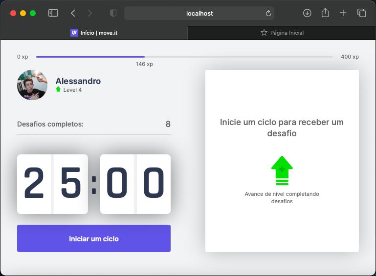
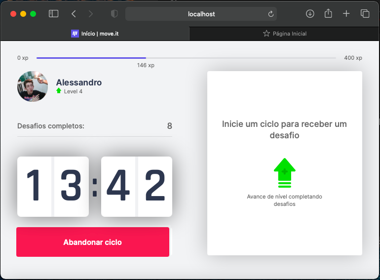
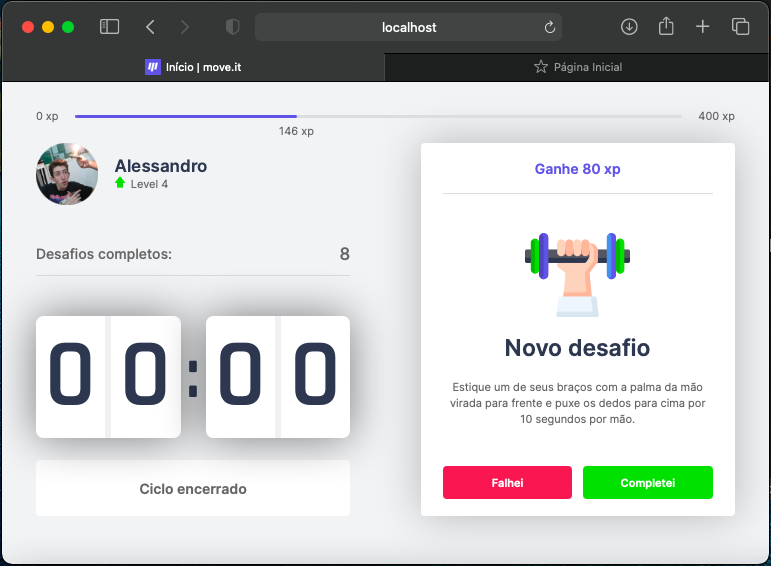

# Move.it-NLW-04

<p align="center">
    
</p>

<p align="center">
  <a href="#project">Projeto</a>&nbsp;&nbsp;&nbsp;|&nbsp;&nbsp;&nbsp;
  <a href="#technologies">Tecnologias</a>&nbsp;&nbsp;&nbsp;|&nbsp;&nbsp;&nbsp;
  <a href="#usage">Utilização</a>&nbsp;&nbsp;&nbsp;|&nbsp;&nbsp;&nbsp;
  <a href="#license">Licença</a>
</p>

<p align="center">
  
   
   
   
</p>


## 🚀 Projeto <a name="project"></a>

Aumente sua produtividade, melhore sua saúde, ganhe pontos e suba de nível!

Inpirado na [Técnica de Pomodoro](https://pt.wikipedia.org/wiki/Técnica_pomodoro), que alterna períodos de trabalho com intervalos de descanso, o Move.it vai um passo além!

Ao final de cada período de trabalho, receba um desafio ergonômico na forma de um breve exercío para tirar a tensão das costas, pescoço, pernas, braços ou olhos. Complete diversos desafios para ganhar pontos de experiência e subir de nível!

O app conta com diversos recursos para tornar o desafio envolvente:
 - [x] Barra de Progresso para fácil visualização da Experiência
 - [x] Aviso sonoro quando o timer zerar e um novo desafio estar disponível
 - [x] Tela de Parabéns quando o Usuário atingir um novo Nível
 - [x] Progresso, Nível e Experiêncis salvos automaticamente (dados armazenados em cookies no computador do Usuário) 

 Aplicação desenvolvida durante a **[Next Level Week #4](https://nextlevelweek.com/)**, realizada pela **@Rocketseat**.


## 🛠️ Tecnologias <a name="technologies"></a>

Esse projeto foi desenvolvido com as seguintes tecnologias:
- [React](https://reactjs.org)
- [Next.js](https://nextjs.org/)
- [TypeScript](https://www.typescriptlang.org/)


## 🗂️ Utilização <a name="usage"></a>

### 📥 Baixando o código:

```bash
  # Clone the repository
  $ git clone https://github.com/Alessandro1918/Move.it-NLW-04
```

### ▶️ Rodando o App:

```sh
  $ cd move.it-NLW-04
  
  # Install dependencies.
  $ npm install   # or: yarn
  
  # Start the project:
  $ npm run dev   # or: yarn dev

  # Check out the page at:
  $ http://localhost:3000
```
  
## 📝 Licença <a name="license"></a>

Esse projeto está sob a licença MIT. Veja o arquivo [LICENSE](LICENSE.md) para mais detalhes.
